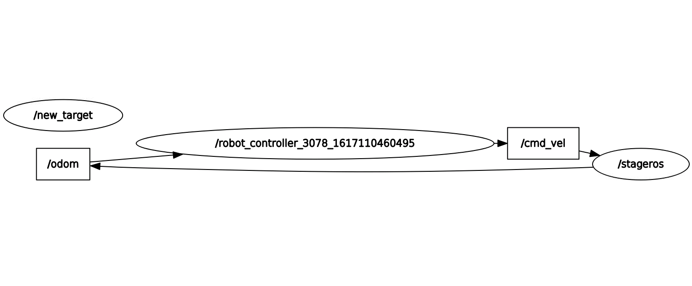

# RT_I-Assignement_I

The ROS nodes here contained allow for controlling an holonomic robot by computing the velocity needed to drive it towards a target position.
The target position is here defined as a couple of random values between (-6.0, 6.0).
All nodes and custom services are contained in the package **sol_1_pkg**, along with their documentation.

## Running the code

The provided **sol_1_pkg** package the python scripts stored in the /sol_1_pkg/scripts must be executable. 
and the package has to be compiled running
 
```bash
# catkin_make
```
in the root directory of the ROS workspace.

The nodes presented can be started together by calling the launch file **sol_launch.xml** included in the package

```bash
$roslaunch sol_1_pkg sol_launch.xml
```

Alternatively, the single nodes can be called, individually, with the commands:

```bash
$$rosrun stage_ros stageros $(rospack find assignment1)/world/exercise.world

$rosrun sol_1_pkg robot_controlloer_server.py

$rosrun sol_1_pkg robot_controller_client.py
```

---------

## Dependencies

The nodes in the package perform the computation by reading from the topics _"/odom"_ and publishing in _"/cmd_vel"_.
The latters are supplied by an external simulation node, in the specific case, the simulator shared by Professor Recchiuto at the link https://github.com/CarmineD8/assignment1.git has here been used:

```bash
$rosrun stage_ros stageros $(rospack find assignment1)/world/exercise.world
```
Note that this package requires **stage_ros**, which can be obtained with
```bash
$sudo apt-get install ros-<your_ros_version>-stage-ros
```

---------

## Relational Graph


- **cobot controller** is subscribed to _"/odom"_ and publishes in _"/cmd_vel"_, while 
	calling Services _"/new_target"
- **new_target** serves for Service _"/new_target"_

## Nodes

Two nodes are present, one Service Server and one publishing the velocity informations.

#### robot controller

This node is the one responsible for publishing velocity data on the topic _"/cmd_vel"_.
It reads the estimated position of the active robot from the _"/odom"_ topic and, if the current target hasn't been reached, .
it updates the speed of the robot multipling a fixed gain term and the difference in between the current position of the robot and the target point.
Once reached the target, the node will call the Service new_target which will provide the coordinates of a new point to reach on the map.

#### new_target

Server node serving new_target, for the Service _"Target"_. When a request is issued 
it fills the _response_ field of the Service with a new random position that is composed of two random 
_x_target_ and _y_target_ coordinates.


