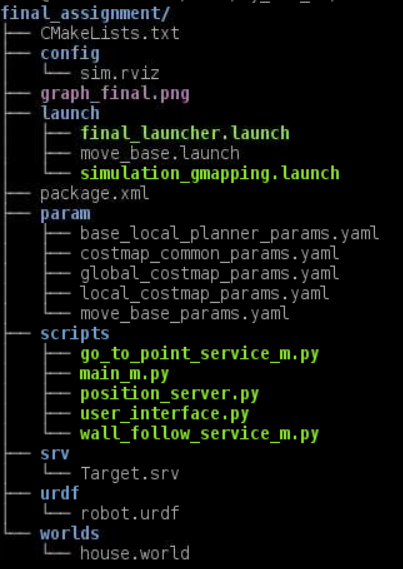
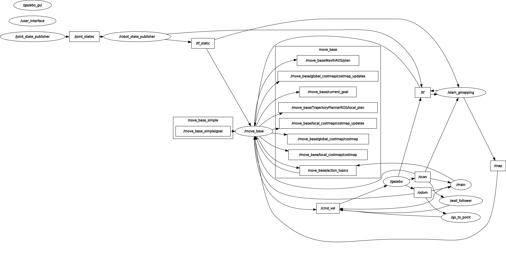

#  RT_I-Assignement_II

### Content description 

The ROS package **final_assignment** here presented is to be intended as complementar to the 'gmapping' one,
since all nodes herein are developed in a way that does not require any modification to be made to those ones.
The content of the package is the following:


- **CMakeLists.txt:** the cmake file of the package;
- **simulation_gmapping.launch:** tha is required for the definition of the robot and of the simulation environment
	it includes the creation of the simulation in **Gazebo** and its visualizarion in **rviz** with pretuned
 	parameters.
	All the required setting for the simulation are stored in the **worlds**, **urdf** and **param** folders
- **final_launcher.launch:** the launch files for the nodes required for the control of the robot including:
	- the main node from **main_m.py** that manages the control of the robot
	- the move_base node via the **move_base.launch** launcher
	- the bug_o nodes importing the **go_to_point_service_m.py** and **wall_follow_service_m.py** scripts
	- the user interface via the **user_interface.py** script
	- it itializes all the parameters for the robot control.
- **user_interface.launch:** the other launch file, inside it are defined the nodes that interface with the
	user and shall thus be run separately from the one constantly printing on video the position of the
	robot;

---

### Computational graph and communications


**move_base** node is directly the node responsible for the control of the robot.
from _'/cmd_vel'_ (and relative remapped versions plus the multiplexer governing them, more on that later), to the 
remapped 'go_to_point' and 'wall_follower' switch, of course both _'/odom'_ and _'/move_base/goal'_ and both the
topics notifying of target reached or unreachable. 
The node _'/user_interface'_ is invoked once that the target it seareched to define the next action of the robot.

---

### Compiling and running

Both the _'gmapping'_ and _'final_assignment'_ packages are **necessary** to run the package here provided (and thus
required by the CMake file). If all three packages are present on the machine it's sufficient to run 
```bash
# catkin_make
```
in the root directory of the ROS workspace to compile everything.

Two separated launch files are included in the package, both need to be run simultaneously on separate shells
in order to control the robot and observe its position. Moreover, the _simulation_gmapping.launch_ file present inside
_'final_assignment'_ package has to be run in another shell window to run both **rviz** and **Gazebo**, necessary for 
the simulation.
```bash
# roslaunch final_assignment simulation_gmapping.launch

# roslaunch nonholo_control nonholo_control.launch
```
---

### Robot behaviour

The robot behavior can be defined via the user interface selecting in between six possible differet choices:
[1] The robot tries to reach a random target position selected between six different predefined spots.
[2] The robot tries to reach a user defined position selected between six different spots.
[3] The robot points to the closer wall and, once reached, it starts following it for a predefined amount of time.
[4] The robot keeps its position for a specified amount of time.
[5] The robot changes the planning algorithm between the dijkstra's and the 'bug0' one.

Notes:	- The robot is spawn at the location [-4,8]
	- The dijkstra's algorithm is selected during the initialization as the default path planning algorithm
	- The first target is initilaized at the location [-4,7]
	- If the robot is not capable of reaching the new target in two minuts when the 'bug0' algorithm is active
	  it automatically switches to the  dijkstra's('move_base') one. 
	

---

### Design choices
Due to the fact that most of the features needed for the control of the robot are linked with the 'move_base' node a copy of the 'bug_m' script 
has been edited to include all the 

Five different parameters have been used to define the status of the robot and specify its bahaviour. Among the others are worth to note:
'des_pos_x' and  'des_pos_y': to specify the desired coordinates of the robot target (initialized to [-4,7])
'state_value': to specify the robot status (initialized to 0)
'target_time': to specify the time for doing specific actions such as keeping the position and following the walls (initialized to 0)
'bug_trigger': to indicate if the 'bug0' algorithm is active (initializaed to 0 -> Incative)


---

### Limitations 

Of course, one main issue related to the approach followed is that the entire project is largely unoptimized, many more services and
checks are implemented with respect to what would have been by modifying few lines of code in the 'bug_m' script. On top of that, the 
recovery behaviour is quite rudimental and, due to the way the system operates, it automatically changes the planning algorithm to 
'move_base', no matter what was used before (but it can easily be reverted back to 'bug0' via the UI once the safe goal is reached).
Even more, having to restart a node to make everything work is generally a strategy to avoid but, since it's technically due to a planning
error, it's not completely inappropriate either: for sure not the most elegant approach.
As a side note, more graphical than anything, once a wall following procedure is started the previous goal is still displayed on 
'rviz', which might confuse an unexperienced user.
Moreover, having always both planners work on each target but reading up only one of the two outputs is surely a waste of resources,
which would need to be optimized in a real world scenario.
Lastly, since the check on a target being reached is leaved to the pre-existing algorithms, the parameters therein define the tolerance
of the final position with respect to the given goal, which can lead to some occasional problem, where the distance from the target would
be just slightly larger than the threshold and both 'bug0' and 'move_base' would need few seconds to stop, even if the robot is not moving 
(but in all tests performed still managed to converge, thanks to 'move_base' target detection). A simple workaround would be to enlarge the
tolerance value in 'bug_m.py' script to something closer to 0.5, which wasn't done here since that value is hardcoded in the script itself. 

