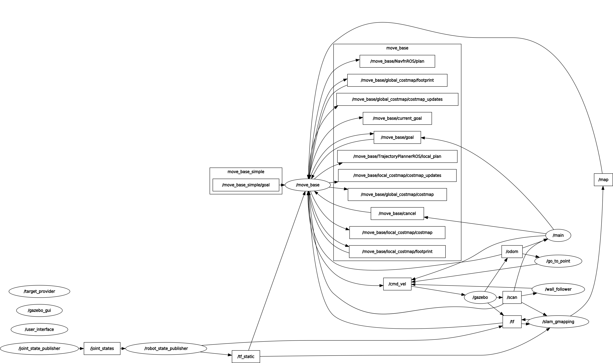

#  RT_I-Assignement_II

### Content description 

The ROS package **final_assignment** here presented is to be intended as complementary to the 'gmapping' one,
since all nodes herein are developed in a way that does not require any modification to be made to those ones.
The content of the package is the following:


- **CMakeLists.txt:** the cmake file of the package; 
- **package.xml:** the XML file describing package requisites
- **simulation_gmapping.launch:** that is required for the definition of the robot and of the simulation environment
	it includes the creation of the simulation in **Gazebo** and its visualizarion in **rviz** with pre-tuned
 	parameters.
	All the required setting for the simulation are stored in the **worlds**, **urdf**, 
	**param** and **config** folders.
- **final_launcher.launch:** the launch files for the nodes required for the control of the robot including:
	- the main node from **main_m.py** that manages the control of the robot
	- the move_base node via the **move_base.launch** launcher
	- the bug_0 nodes importing the **go_to_point_service_m.py** and **wall_follow_service_m.py** scripts
	- the user interface via the **user_interface.py** script
	- the server node _'/target_provider'_ via the **possition_server.py** script 
	- it initializes all the parameters for the robot control.
- **user_interface.py:** the other launch file, inside it are defined the nodes that interface with the
	user and shall thus be run separately from the one constantly printing on video the position of the
	robot.
- **Target.srv:** a server that provides the new target id to the robot.

---

### Robot behaviour

The robot behavior can be defined via the user interface selecting in between six possible different choices:
- **[1]** The robot tries to reach a random target position selected between six different predefined spots.
- **[2]** The robot tries to reach a user defined position selected between six different spots.
- **[3]** The robot points to the closer wall and, once reached, it starts following it for a predefined amount of time.
- **[4]** The robot keeps its position for a specified amount of time.
- **[5]** The robot changes the planning algorithm between the dijkstra's and the 'bug0' one.

Notes:
- The robot is spawn at the location [-4,8]
- The dijkstra's algorithm is selected during the initialization as the default path planning algorithm
- The first target is initialized at the location [-4,7]
- If the robot is not capable of reaching the new target in two minutes when the 'bug0' algorithm is active it automatically switches to the dijkstra's('move_base') one. 
	  
---

### Computational graph and communications


The **/main** node is the direct responsible for the robot control.
It receives the information from the robot about its current position (**_'/odom'_**) and the laser sensor (**_'/scan'_**) and it interacts with both the 'bug0' and the 'move_base' controller.
On one side, it sets and cancels the target of the **_'/move_base'_** node by publishing on the topics **_'/move_base/goal'_** and **_'/move_base/cancel'_**; the robot then automatically computes the best path accordingly with its knowledge of the environment (_'/map'_). 
On the other side, when the 'bug_0' algorithm is active, the **/main** node sets directly the speed of the robot publishing on the **_'/cmd_vel'_** topic.
Other robot behaviours, such as the wall following and the keeping of the position are locally set at the level of the **/main** node and the parameters
for the control internally set and updated.
Once that the desired action is completed the **/main** node interacts with the user interface requesting for a new action to be executed.
The new actions are handled by the user interface (**_'/user_interface'_**) updating the internal parameters required for the specific action.
If a new random target is required, it is directly the user interface that request a new target to the service **_'/target_provider'_**.

---

### Compiling and running

Both the _'gmapping'_ and _'final_assignment'_ packages are **necessary** to run the package here provided (and thus
required by the CMake file). If all three packages are present on the machine it's sufficient to run 
```bash
# catkin_make
```
in the root directory of the ROS workspace to compile everything.

Two separated launch files are included in the package, both need to be run simultaneously on separate shells
in order to control the robot and observe its position. Moreover, the _simulation_gmapping.launch_ file present inside
_'final_assignment'_ package has to be run in another shell window to run both **rviz** and **Gazebo**, necessary for 
the simulation.
```bash
# roslaunch final_assignment simulation_gmapping.launch

# roslaunch final_assignment final_launcher.launch
```
---

Notes: All the python scripts in the -'/scripts'_ folder must be executable.	

---

### Design choices

A _'/main'_ node direclty interactig with both the 'move_base' and the 'bug0' varibles and topics has here been chosen to control the robot.
This node publishes at the same time on the '/cmd_vel' and on the '/move_base/goal' topics to specify the velocity/target for any 
possible active path planning algorithm. 
When the target is reached, it is the _'/main'_ node that set to zero the '/cmd_vel' topic and publishes on the topic '/move_base/cancel' 
to indicate that the target has reached and cancel the target of the move_base algorithm.
The same node is also responsible for managing any other possible behaviours implemented in this non-holonomic robot.
As previously mentioned, the robot, independently from the active path planning algorithm can start following the walls of the environment or keep its position. Both these behaviours are executed for a user defined amount of time. 
Every time that an action is completed the '/main' nodes calls the user interface that handles the new required action and is responsible for interacting with the 
A command line based user interface has been here defined to specify the new robot action and, if a new random target is requested, it interacts with the _'/target_provider'_ service to get a new location to be reached.
In this specific implementation, the status of the robot is controlled using five different parameters:
'des_pos_x' and  'des_pos_y': two float to specify the desired coordinates of the robot target (initialized to [-4,7])
'state_value': a integer between 0 and 5 to identify the robot status (initialized to 0)
'target_time': a positive float to specify the time for doing specific actions such as keeping the position and following the walls (initialized to 0)
'bug_trigger': a boolean parameter (0/1) to indicate if the 'bug0' algorithm is active (initialized to 0 -> Incative)
The same monitoring status could have been possible by using independent server.

---

### Limitations and improvements

- A clear limitation of the currnet algorithm is the fact that any time that a new target is requested and created, the code automatically acts on both the topic involved in the 'move_base' and the 'bug0' algorithms. 
A selective publication of the topic conditioned by the current active algorithm could be preferrable.
Moreover, the algorithm does not allow the user to interrupt any active action without killing the nodes or the control of the robot. 
For this reason, anytime that the user wants to stop the robot, he/she has to launch again the **final_launcher.launch** script that forces the robot to move back to its initial target stop at coordinates [-4,7].
A system to interrupt the robot current action and trigger the user interface to specify a new action at anytime whould be preferrable.
Moreover, in case of failure of the '/main' node there is no back-up strategy to bring the robot in a specified safe position but it simply stops working. The implementation of a safe arrest position and a recovery condition would be preferrable.
- In the current verion when the _'wall_folloiwing'_ [3] status in requested the robot look for the closer wall detected by the laser sensor and it points that wall.
Unfortunately in this behaviour, the closer wall detected by the sensor does not always with the closer wall in absolute terms since it depends on the robot pose. 
To identify the closer wall in absolute term the robot should make a 360 complete turn and scan the whole surrounding environment in order to define and store the orientation of the closer wall and only then point it and proceed to reach the wall. This improvement has noticed but not impreoved in this version of the package.
- From a visualization point of view it has to be noticed that
	-  The target is indicated only if the 'move_base' algorithm is the selected one
	-  The local planned trajectory is continuosly displayed even if the 'bug_0' algorithm is the active one.


